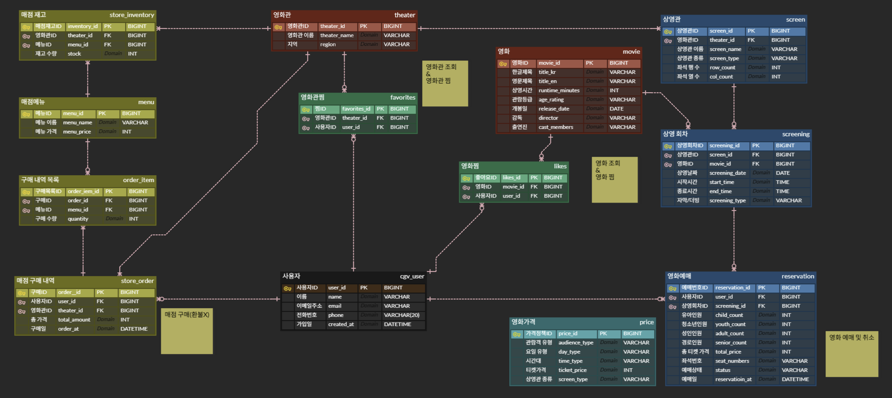
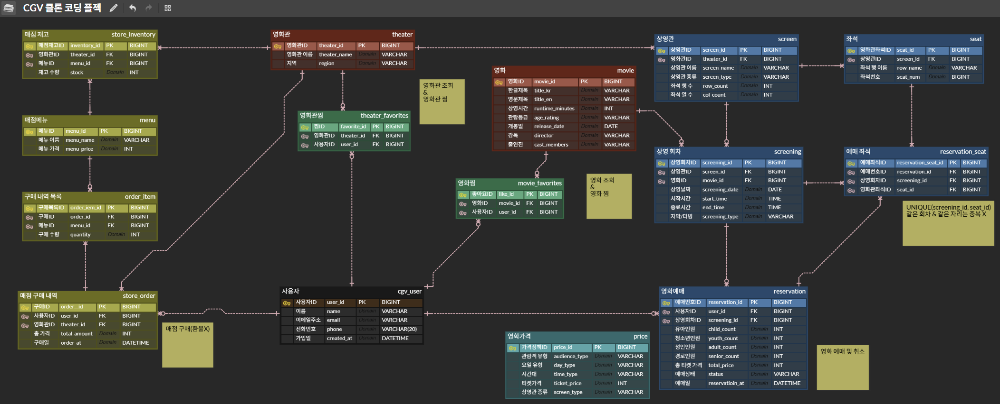

# spring-cgv-24th
CEOS 24기 백엔드 스터디 - CGV 클론 코딩 프로젝트

# 🎬 CGV Clone Project

CGV 서비스를 참고하여 영화 조회, 극장 및 상영 정보 조회, 영화 예매, 매점 주문, 영화/극장 찜 기능을 구현하는 Spring Boot 프로젝트입니다.

이번 과제에서는 실제 서비스를 구현하기 전에 서비스에서 필요한 데이터를 분석하여 **ERD를 설계**하고, 이를 바탕으로 **JPA Entity와 Repository 계층**을 구현했습니다.

---

# 1. CGV 서비스 분석 및 ERD 설계

## 1-1. 서비스에서 필요한 데이터

CGV 서비스를 구성하기 위해 크게 다음과 같은 데이터를 관리해야 한다고 판단했습니다.

| 도메인             | 필요한 데이터                               |
|-----------------|---------------------------------------|
| cgv_user        | 사용자 이름, 이메일, 전화번호, 가입일                |
| movie           | 영화 제목, 감독, 출연진, 러닝타임, 개봉일, 관람 등급      |
| theater         | 극장명, 지역 및 극장 정보                       |
| screen          | 상영관 이름, 상영관 종류, 좌석 행/열                |
| screening       | 상영 영화, 상영관, 상영 날짜, 시작/종료 시간, 자막/더빙 여부 |
| reservation     | 예매 사용자, 상영 회차, 좌석, 인원, 총 가격, 예매 상태    |
| price           | 관람객 종류, 요일, 상영관 종류, 시간대에 따른 가격        |
| store_inventory | 메뉴, 가격, 영화관별 재고                       |
| store_order     | 주문 사용자, 주문 극장, 주문 상품, 수량, 총 가격        |
| favorites       | 사용자가 찜한 영화관                           |
| likes           | 사용자가 찜한 영화                            |

서비스의 기능을 단순히 테이블 하나씩 대응시키기보다, **어떤 데이터가 독립적으로 존재하는지와 데이터가 어떤 관계를 가지는지**를 중심으로 ERD를 설계했습니다.

---

## 1-2. ERD

> 아래 부분에 최종 ERD 이미지를 첨부합니다.

```md

```

는 다음과 같습니다.

```text
User
 ├── Reservation ── Screening ── Movie
 │                       │
 │                     Screen
 │                       │
 │                    Theater
 │
 ├── StoreOrder ── OrderItem ── Menu
 │        │
 │     Theater
 │
 ├── Favorites ── Theater
 │
 └── Likes ── Movie

Theater
 └── StoreInventory ── Menu
```

---

## 1-3. Entity 설명

### `User`

CGV 서비스를 이용하는 회원 정보를 관리합니다.

예매, 매점 주문, 영화 좋아요, 영화관 찜 등 대부분의 사용자 활동의 기준이 되는 Entity입니다.

사용자 한 명은 여러 개의 예매, 주문, 찜 정보를 가질 수 있습니다.

---

### `Movie`

영화 자체의 고유한 정보를 관리합니다.

영화 제목, 감독, 출연진, 러닝타임, 개봉일, 관람 등급 등의 정보를 가집니다.

영화 자체의 정보와 실제 상영 정보는 다르기 때문에 `Screening`과 분리했습니다.

예를 들어 하나의 영화가 여러 극장, 여러 상영관, 여러 시간대에 상영될 수 있으므로 다음과 같은 관계를 가집니다.

```text
Movie 1 : N Screening
```

---

### `Theater`

실제 CGV 극장 정보를 관리합니다.

하나의 극장에는 여러 개의 상영관이 존재할 수 있기 때문에 `Screen`과 1:N 관계를 가집니다.

```text
Theater 1 : N Screen
```

또한 극장마다 매점 상품의 재고가 다를 수 있으므로 `StoreInventory`와도 연결됩니다.

---

### `Screen`

극장 내부에 존재하는 **물리적인 상영관**을 의미합니다.

예를 들어 `1관`, `2관`, `IMAX관`과 같은 공간 자체를 표현합니다.

주요 정보는 다음과 같습니다.

* 상영관 이름
* 상영관 종류
* 좌석 행 수
* 좌석 열 수

하나의 상영관에서는 시간에 따라 여러 영화가 상영될 수 있기 때문에 실제 영화 상영 일정은 `Screening`에서 관리합니다.

```text
Theater 1 : N Screen
Screen 1 : N Screening
```

---

### `Screening`

특정 영화가 특정 상영관에서 **언제 상영되는지**를 나타내는 Entity입니다.

다음과 같은 정보를 관리합니다.

* Movie
* Screen
* 상영 날짜
* 시작 시간
* 종료 시간
* 자막 / 더빙 여부

즉,

```text
Movie + Screen + Date + Time
```

의 조합이 하나의 상영 회차가 됩니다.

영화 자체의 정보와 상영 일정을 분리함으로써 같은 영화가 여러 극장과 시간대에서 상영되는 구조를 표현할 수 있도록 설계했습니다.

---

### `Reservation`

사용자의 영화 예매 정보를 관리합니다.

다음과 같은 정보를 가집니다.

* 예매한 사용자
* 상영 회차
* 좌석 번호
* 성인 / 청소년 / 어린이 / 경로 인원
* 총 결제 금액
* 예매 시간
* 예매 상태

예매는 특정 영화 자체가 아니라 **특정 시간에 진행되는 상영 회차**에 대해 발생하기 때문에 `Movie`가 아닌 `Screening`과 연결했습니다.

```text
User 1 : N Reservation
Screening 1 : N Reservation
```

---

### `Price`

영화 티켓 가격 정책을 표현하기 위한 Entity입니다.

CGV의 영화 가격은 하나의 값으로 결정되는 것이 아니라 여러 조건에 따라 달라질 수 있다고 판단했습니다.

예를 들어 다음과 같은 조건을 가집니다.

* 관람객 유형
* 평일 / 주말
* 일반관 / 특별관
* 시간대

따라서 가격 자체를 `Reservation`에 고정값으로 정의하기보다는 별도의 `Price` 구조로 분리했습니다.

---

### `Menu`

매점에서 판매되는 상품 자체를 관리합니다.

예를 들어 팝콘, 콜라 등의 상품명과 기본 가격을 저장합니다.

메뉴 자체의 정보와 특정 극장의 재고는 다른 개념이기 때문에 재고는 `StoreInventory`에서 별도로 관리합니다.

---

### `StoreInventory`

각 극장이 가지고 있는 매점 상품의 재고를 관리합니다.

처음에는 `Menu` 자체에 재고를 저장하는 방법도 생각했지만, 동일한 팝콘 상품이라도 강남점과 신촌점의 재고는 서로 다를 수 있습니다.

따라서 다음과 같이 분리했습니다.

```text
Theater + Menu → StoreInventory
```

이를 통해 **같은 메뉴를 여러 극장에서 공유하면서 극장별 재고는 독립적으로 관리**할 수 있습니다.

`stock`은 실제 판매 가능한 재고를 의미하며 도메인에서 유효한 재고 값이 유지되도록 관리합니다.

---

### `StoreOrder`

사용자가 특정 영화관의 매점에서 생성한 주문을 관리합니다.

다음과 같은 정보를 가집니다.

* 주문 사용자
* 주문 극장
* 주문 시간
* 총 주문 금액

한 번의 주문으로 여러 개의 상품을 구매할 수 있기 때문에 상품 정보를 직접 저장하지 않고 `OrderItem`으로 분리했습니다.

---

### `OrderItem`

하나의 주문에 포함되는 개별 상품을 관리합니다.

```text
StoreOrder 1 : N OrderItem
```

예를 들어

```text
주문 #1
├── 팝콘 × 1
├── 콜라 × 2
└── 핫도그 × 1
```

과 같은 주문을 표현할 수 있습니다.

---

### `Favorites`

사용자가 자주 이용하는 영화관을 찜하는 정보를 관리합니다.

```text
User N : M Theater
```

의 관계를 직접 표현하는 대신 연결 Entity인 `Favorites`를 사용했습니다.

---

### `Likes`

사용자가 관심 있는 영화를 좋아요한 정보를 관리합니다.

처음에는 영화관 찜 기능만 생각했지만 서비스 기능을 분석하면서 **영화 자체에 대한 좋아요 기능도 별도의 관계가 필요하다**고 판단했습니다.

따라서

```text
Favorites → User ↔ Theater
Likes     → User ↔ Movie
```

로 역할을 분리했습니다.

---

# 2. ERD를 작성하면서 겪은 시행착오

ERD를 처음 작성할 때는 필요한 데이터를 테이블로 옮기는 것에 집중했습니다.

하지만 실제 기능을 하나씩 생각해보면서 **"데이터가 무엇인가"보다 "각 데이터가 어떤 책임을 가지는가"가 더 중요하다는 점**을 알게 되었습니다.

## 2-1. `Screen`과 `Screening`의 구분

초기에는 상영관과 영화 상영 정보를 하나의 개념으로 생각했습니다.

하지만 `Screen`은 극장 내부에 실제로 존재하는 공간이고 `Screening`은 그 공간에서 특정 시간에 진행되는 영화 상영이라는 차이가 있습니다.

예를 들어 `CGV 신촌 1관`이라는 상영관은 계속 존재하지만,

```text
10:00 영화 A
13:00 영화 B
16:00 영화 A
```

와 같이 상영 일정은 계속 변경됩니다.

따라서

```text
Theater → Screen → Screening ← Movie
```

구조로 분리했습니다.

이를 통해 물리적인 상영관 정보가 상영 회차마다 반복 저장되는 것을 방지할 수 있었습니다.

---

## 2-2. 자막/더빙 정보는 Movie가 아닌 Screening에 저장

처음에는 자막/더빙 여부를 영화 정보로 생각할 수도 있었습니다.

하지만 같은 영화라도

```text
10:00 자막
13:00 더빙
```

처럼 상영 회차에 따라 형식이 달라질 수 있습니다.

따라서 자막/더빙 정보는 `Movie`가 아니라 `Screening`의 속성으로 관리했습니다.

이 과정을 통해 **값이 어느 Entity에 속해야 하는지는 값 자체보다 값이 언제 변화하는지를 기준으로 판단해야 한다**는 것을 알게 되었습니다.

---

## 2-3. 같은 Enum을 사용한다고 Entity 관계가 생기는 것은 아니다

`Screen`에서는 상영관 종류를 구분하기 위해 `ScreenType`을 사용하고, 가격을 계산할 때도 상영관 종류가 필요합니다.

처음에는 같은 종류 정보를 사용하므로 `Screen`과 `Price` 테이블을 직접 연결해야 하는지 고민했습니다.

하지만 두 Entity가 단순히 동일한 Enum 값을 사용한다는 것과 DB상의 관계를 가지는 것은 다른 문제라고 판단했습니다.

`ScreenType`은 두 Entity에서 사용되는 **공통된 값의 종류**일 뿐이므로 이를 이유로 불필요한 FK 관계를 추가하지 않았습니다.

---

## 2-4. 한 번의 예매에서 여러 좌석을 선택할 수 있음

초기 ERD에서는 좌석 번호 하나만 생각했지만 실제 예매에서는

```text
H12, H13
```

과 같이 한 번의 예매에서 여러 좌석을 선택할 수 있습니다.

따라서 예매 데이터는 단순히 하나의 좌석 번호만 존재한다고 가정하면 안 된다는 점을 알게 되었습니다.

현재 프로젝트 범위에서는 `Reservation`에서 선택한 좌석 정보를 관리하도록 구현했으며, 추후 좌석별 상태 관리나 동시 예매까지 구현한다면 `Seat` 또는 `ReservationSeat` Entity로 분리할 수 있습니다.

---

## 2-5. 메뉴와 매점 재고 분리

처음에는 메뉴 Entity에 상품 재고까지 저장하는 구조를 생각했습니다.

하지만 메뉴 자체는 여러 영화관에서 공통으로 판매할 수 있는 반면 재고는 영화관별로 달라집니다.

예를 들어 동일한 `고소팝콘`이라도

```text
CGV A점 → 10개
CGV B점 → 3개
```

가 될 수 있습니다.

따라서

```text
Menu
Theater
   ↓
StoreInventory
```

구조로 변경했습니다.

이를 통해 상품 정보와 영화관별 재고 정보를 분리할 수 있었습니다.

---

## 2-6. 주문과 주문 상품 분리

하나의 주문에는 여러 상품이 포함될 수 있습니다.

처음부터 모든 상품을 `StoreOrder` 하나에 저장하면 상품 수가 늘어날수록 구조가 복잡해집니다.

따라서

```text
StoreOrder 1 : N OrderItem
```

관계로 분리했습니다.

`StoreOrder`는 주문 자체를 의미하고, `OrderItem`은 주문에 포함된 각각의 상품과 수량을 의미합니다.

---

## 2-7. 영화관 찜과 영화 좋아요 분리

처음에는 영화관을 찜하는 기능을 중심으로 Favorite 관련 Entity를 설계했습니다.

하지만 기능을 다시 분석하면서 사용자는 영화관뿐만 아니라 영화에도 관심 표시를 할 수 있다는 점을 발견했습니다.

두 기능은 대상이 서로 다르기 때문에 하나의 Favorite 테이블에서 모두 처리하기보다 역할을 분리했습니다.

```text
Favorites → User + Theater
Likes     → User + Movie
```

이를 통해 각 관계의 의미가 더 명확해졌습니다.

---

## 2-8. ENUM과 데이터 타입 결정

ERD를 처음 작성하면서 `VARCHAR`, `INT`, `BIGINT`, `ENUM` 등을 어떤 기준으로 선택해야 하는지도 고민했습니다.

PK는 데이터가 지속적으로 증가할 수 있다는 점과 JPA Entity ID 타입을 고려하여 주로 `BIGINT`를 사용했습니다.

반면 다음처럼 선택 가능한 값이 명확하게 정해져 있는 데이터는 Enum으로 표현했습니다.

```text
AgeRating
ScreenType
ScreeningType
ReservationStatus
```

예를 들어 영화 관람 등급은 임의의 문자열을 입력받는 값이 아니라 정해진 값 중 하나이기 때문에 문자열로 직접 관리하는 것보다 Enum으로 관리하는 것이 안전하다고 판단했습니다.

---

# 3. Domain / Repository 계층 구현

ERD 설계를 바탕으로 JPA Entity와 Repository 계층을 구현했습니다.

## 3-1. Domain의 역할

Domain은 단순히 DB 테이블을 Java 클래스로 옮기는 것이 아니라 **서비스에서 사용하는 데이터의 구조와 의미를 표현하는 계층**이라고 생각했습니다.

예를 들어

```java
Movie
Theater
Screen
Screening
Reservation
```

등의 Entity는 각각 자신의 데이터를 가지고 있으며 Entity 간의 관계를 통해 CGV 서비스의 구조를 표현합니다.

즉,

> **Domain은 데이터의 구조와 의미를 정의한다.**

---

## 3-2. Repository의 역할

Repository는 Domain Entity를 실제 DB에 저장하거나 조회하기 위한 계층입니다.

이번 프로젝트에서는 Spring Data JPA의 `JpaRepository`를 사용했습니다.

```java
public interface MovieRepository extends JpaRepository<Movie, Long> {
}
```

`JpaRepository`를 상속하면 기본적으로 다음과 같은 CRUD 기능을 사용할 수 있습니다.

```java
save()
findById()
findAll()
delete()
deleteById()
```

따라서 반복적인 CRUD SQL을 직접 작성하지 않고 Entity 중심으로 데이터에 접근할 수 있습니다.

> **Repository는 Domain Entity를 DB에 저장하고 조회하는 역할을 한다.**

---

## 3-3. User Entity 구현

서비스의 대부분의 기능은 사용자를 기준으로 동작하기 때문에 `User` Entity를 구현했습니다.

```text
User
 ├── Reservation
 ├── StoreOrder
 ├── Favorites
 └── Likes
```

사용자는 영화 예매와 매점 주문을 할 수 있고, 영화관을 찜하거나 영화에 좋아요를 남길 수 있습니다.

따라서 User는 여러 도메인과 관계를 가지는 핵심 Entity 중 하나입니다.

---

## 3-4. 도메인을 나눈 기준

처음에는 단순히 Entity마다 패키지를 만드는 방법도 생각했지만, 관련된 Entity를 기능 단위로 묶는 것이 구조를 이해하기 쉽다고 판단했습니다.

최종적으로 다음과 같이 도메인을 구분했습니다.

```text
user
└── User

movie
├── Movie
└── AgeRating

theater
├── Theater
├── Screen
├── Screening
├── ScreenType
└── ScreeningType

reservation
├── Reservation
├── Price
└── Reservation 관련 Enum

shop
├── Menu
├── StoreInventory
├── StoreOrder
└── OrderItem

favorite / like
├── Favorites
└── Likes
```

### `movie`

영화 자체의 정보를 담당합니다.

### `theater`

극장, 물리적 상영관, 상영 회차처럼 **영화가 실제로 상영되는 공간과 일정**을 담당합니다.

### `reservation`

특정 상영 회차에 대한 사용자 예매와 가격 정보를 담당합니다.

### `shop`

매점 상품, 극장별 재고, 주문과 주문 상품처럼 **매점 구매 흐름**을 담당합니다.

### `favorite / like`

User와 Movie 또는 Theater 사이의 관심 관계를 담당합니다.

이처럼 단순히 테이블 개수를 기준으로 나눈 것이 아니라 **같은 기능 흐름에서 함께 변경되고 사용되는 Entity들을 하나의 도메인으로 묶는 것**을 기준으로 패키지를 구성했습니다.

---

## 3-5. 모든 Entity에 Repository가 필요한가?

처음에는

> "Entity를 만들었으면 Repository도 모두 만들어야 하는 것 아닌가?"

라고 생각했습니다.

하지만 Repository는 Entity가 존재한다는 이유만으로 반드시 만들어야 하는 것은 아니라고 판단했습니다.

Repository 작성 여부를 결정할 때 다음 기준을 사용했습니다.

> **이 객체를 애플리케이션에서 독립적인 조회·저장 단위로 다룰 필요가 있는가?**

예를 들어 `Movie`, `Theater`, `Screening`처럼 서비스에서 직접 조회하거나 저장해야 하는 데이터라면 Repository가 필요합니다.

```java
public interface MovieRepository
        extends JpaRepository<Movie, Long> {
}
```

반면 현재 구현 범위에서 독립적인 CRUD가 필요하지 않고 다른 도메인의 로직 안에서만 사용되는 객체라면 별도의 Repository를 만들지 않았습니다.

### Price의 경우

`Price`는 영화 예매 금액을 결정하기 위한 가격 정책을 표현합니다.

현재 프로젝트에서는 가격 자체를 별도의 기능으로 등록·수정·삭제하는 기능을 제공하는 것이 목적이 아니라 **예매 가격을 결정하기 위한 데이터**로 사용하기 때문에 별도의 Repository를 두지 않았습니다.

즉,

```text
Entity 존재 여부
        ≠
Repository 필요 여부
```

이며 Repository는 실제 애플리케이션에서 해당 데이터를 어떻게 사용할지를 기준으로 결정했습니다.

---

# 4. ERD와 Domain을 설계하며 배운 점

이번 과제를 진행하면서 ERD는 단순히 필요한 테이블을 나열하는 작업이 아니라는 것을 알게 되었습니다.

처음에는 CGV 화면에서 보이는 정보를 그대로 테이블로 만들려고 했지만, 기능을 하나씩 생각하면서 데이터의 의미와 변경 주기가 서로 다르다는 것을 확인했습니다.

특히

```text
Screen과 Screening의 분리
Menu와 StoreInventory의 분리
StoreOrder와 OrderItem의 분리
Favorites와 Likes의 분리
```

과정을 거치면서 **비슷해 보이는 데이터라도 역할과 생명주기가 다르면 별도의 Entity로 나누어야 한다는 점**을 배웠습니다.

또한 같은 Enum을 사용한다는 이유만으로 Entity 사이에 관계를 만들거나, Entity가 존재한다는 이유만으로 Repository를 만드는 것이 아니라

> **실제 서비스에서 데이터가 어떻게 생성되고, 조회되고, 변경되는가**

를 먼저 생각해야 한다는 점을 알게 되었습니다.

이번 ERD 설계와 JPA Entity 구현을 통해 단순한 테이블 설계를 넘어 **서비스의 요구사항을 데이터 모델로 표현하는 과정**을 경험할 수 있었습니다.


[2주차 실습 정리](https://www.notion.so/CEOS-2-3dade222d8e480a29f3fd1494b1cb96e?source=copy_link)

---
# 📝2주차 코드 피드백 및 개선사항
ERD 수정
```md

```

### 1. 예외 처리 방식 통일

기존에는 도메인마다 예외를 처리하는 방식이 달라질 수 있었기 때문에,
`GlobalException`, `ErrorCode`, `GlobalExceptionHandler`를 활용하여 예외 처리 방식을 통일했습니다.

```text
TheaterService
    ↓
GlobalException 발생
    ↓
ErrorCode.THEATER_NOT_FOUND
    ↓
GlobalExceptionHandler
    ↓
ErrorResponse 생성
    ↓
HTTP 404 응답
```

Service에서는 상황에 맞는 `ErrorCode`를 담아 `GlobalException`을 발생시키고,
`GlobalExceptionHandler`가 이를 공통으로 처리하여 `ErrorResponse`를 반환하도록 구성했습니다.

이를 통해 각 Controller나 Service에서 직접 HTTP 응답을 생성하지 않고,
애플리케이션 전체에서 일관된 형식으로 예외를 처리할 수 있도록 개선했습니다.

---

### 2. 재고 추가 API에서 `@RequestParam` 활용

영화관 매점의 특정 재고 수량을 추가하는 API를 구현했습니다.

```http
PATCH /api/shop/1/inventories/3/addStock?quantity=10
```

처리 흐름은 다음과 같습니다.

```text
PATCH 요청
    ↓
Controller
quantity = 10
    ↓
ShopService.addStock(1, 3, 10)
    ↓
StoreInventory.increaseStock(10)
    ↓
기존 stock 20
    ↓
stock 30
```

재고 수량이라는 하나의 단순한 값만 전달하기 때문에 별도의 Request DTO를 추가하지 않고
`@RequestParam`을 사용하여 요청 값을 전달하도록 구현했습니다.

이를 통해 모든 요청에 DTO가 반드시 필요한 것은 아니며,
요청 데이터의 구조와 복잡도에 따라 적절한 전달 방식을 선택할 수 있다는 점을 학습했습니다.

---

### 3. Entity가 생성 책임을 가지도록 개선

기존 영화관 등록 코드에서는 Request DTO가 Entity의 생성 방법까지 알고 있었습니다.

피드백을 반영하여 DTO는 **요청 데이터를 전달하는 역할**에 집중하고,
Entity가 자신의 생성 규칙을 직접 관리하도록 수정했습니다.

```text
기존

RequestDTO
 ├─ 요청 데이터 전달
 └─ Entity 생성 규칙까지 알고 있음


개선

RequestDTO
 └─ 요청 데이터 전달
          ↓
Theater.create(...)
          ↓
Theater가 자신의 생성 규칙 관리
```

이를 통해 객체 생성에 대한 책임을 Entity 내부로 이동시키고,
Request DTO와 Entity의 역할을 명확하게 분리했습니다.

---

### 4. 좌석과 예약된 좌석 분리

처음에는 예매 정보에서 좌석 번호를 직접 관리했지만,
좌석 자체의 정보와 실제 예매된 좌석을 구분하기 위해 테이블 구조를 개선했습니다.

- `seat` : 영화관 상영관별 실제 좌석 정보
- `reservation_seat` : 특정 예매에 할당된 좌석 정보

```text
Screen
  │
  └── Seat
        │
        └── ReservationSeat
                │
                └── Reservation
```

이를 통해 **존재하는 좌석**과 **현재 예매에 할당된 좌석**의 역할을 분리했습니다.

또한 예매 취소 과정에서 두 데이터의 처리 방식에도 차이가 있습니다.

- `Reservation` : 데이터를 바로 삭제하는 대신 예매 상태를 `CANCELED`로 변경
- `ReservationSeat` : 예매 취소 시 해당 좌석의 할당 정보를 제거

즉, 예매 기록은 상태값을 통해 남겨두면서 실제 좌석은 다시 예약할 수 있도록 처리했습니다.

---

### 5. 비관적 락을 이용한 좌석 동시성 처리

같은 좌석에 여러 사용자가 동시에 예매 요청을 보내는 상황에서는
좌석 중복 예약이 발생할 가능성이 있습니다.

이를 방지하기 위해 비관적 락(`PESSIMISTIC_WRITE`)을 적용했습니다.

비관적 락은 데이터 충돌이 발생할 것이라고 가정하고,
데이터를 조회하는 시점부터 Lock을 걸어 다른 트랜잭션의 수정을 제한하는 방식입니다.

```java
@Lock(LockModeType.PESSIMISTIC_WRITE)
@Query("""
        select s
        from Screening s
        where s.screeningId = :screeningId
        """)
Optional<Screening> findByIdWithLock(
        @Param("screeningId") Long screeningId
);
```

해당 메서드는 `screeningId`에 해당하는 `Screening`을 조회하면서
DB에 `SELECT ... FOR UPDATE`에 해당하는 락을 걸도록 구성했습니다.

```text
사용자 A                    사용자 B
   │                           │
   │ Screening 조회 + Lock     │
   ▼                           │
좌석 예매 처리                  │ 대기
   │                           │
Transaction 종료               │
   │                           ▼
   └──── Lock 해제 ───────→ 이후 처리
```

이를 통해 같은 상영 회차의 좌석 예매 로직이 동시에 실행되면서
중복 예약이 발생하는 상황을 방지하고자 했습니다.

---

### 6. `saveAll()` → `saveAllAndFlush()` 변경

예약 좌석을 저장할 때 `saveAll()` 대신 `saveAllAndFlush()`를 사용하도록 수정했습니다.

```java
reservationSeatRepository.saveAllAndFlush(reservationSeats);
```

좌석 중복 방지를 위해 DB의 `UNIQUE` 제약 조건을 사용하는 경우,
실제 SQL 실행 시점에 제약 조건 위반이 확인됩니다.

따라서 저장 후 즉시 `flush`하여 SQL을 DB에 반영하도록 하고,
`UNIQUE` 제약 조건 위반이 발생한다면 해당 시점에서 확인할 수 있도록 변경했습니다.


---

[3주차 실습 정리](https://app.notion.com/p/CEOS-3-3e5de222d8e48099a302fc1397cf944c?source=copy_link)

# 5. JWT 를 이용한 인증 흐름

## 5-1. JWT의 Header, Payload, Signature 각각의 역할

JWT(JSON Web Token)는 `Header.Payload.Signature` 세 부분으로 구성됩니다.

| 구성 | 역할 |
| --- | --- |
| Header | 토큰 타입과 서명에 사용하는 알고리즘 정보를 저장 |
| Payload | 사용자 정보, 만료 시간 등의 Claim을 저장 |
| Signature | 토큰이 서버에서 발급되었는지, 변조되지 않았는지 검증 |

#### Header
JWT가 어떤 방식으로 서명되었는지에 대한 알고리즘 정보를 담습니다.

#### Payload
JWT에 전달하고 싶은 정보를 `Claim` 형태로 저장합니다.
예를 들어 `userId`, 발급 시간, 만료 시간 등을 저장할 수 있습니다.

> Payload는 암호화되어 숨겨지는 영역이 아니므로 비밀번호와 같은 민감한 정보는 저장하지 않습니다.

#### Signature
JWT가 서버에서 발급된 토큰인지, 전달 과정에서 변조되지 않았는지를 확인하기 위한 서명입니다.

서버의 Secret Key를 이용해 Signature를 생성하기 때문에 Payload를 임의로 변경하거나 다른 Secret Key로 JWT를 생성하면 검증에 실패합니다.

---

## 5-2. Access Token과 Refresh Token 차이

JWT 인증에서는 Access Token과 Refresh Token을 함께 사용할 수 있습니다.

| 구분 | Access Token | Refresh Token |
| --- | --- | --- |
| 역할 | API 접근 및 사용자 인증 | Access Token 재발급 |
| 유효 기간 | 비교적 짧음 | 비교적 긺 |
| 사용 시점 | API 요청 시 | Access Token 만료 후 재발급 시 |

Access Token의 유효 기간을 짧게 설정하면 토큰이 탈취되었을 때 사용할 수 있는 시간을 제한할 수 있습니다.

Refresh Token은 Access Token이 만료되었을 때 새로운 Access Token을 발급받는 데 사용합니다.

현재 CGV 프로젝트에서는 **Access Token을 이용한 인증을 구현**했습니다.

---

### 3. Cookie & Session & JWT의 역할

HTTP는 기본적으로 이전 요청의 로그인 상태를 스스로 기억하지 못하는 **무상태성 한계**를 가집니다.

따라서 사용자를 지속적으로 식별하기 위한 방법이 필요합니다.
> Cookie : 브라우저가 정보를 저장하고 이후 요청에 전달하는 역할

| 구분 | 역할 |
| --- | --- |
| Session | 서버가 사용자의 로그인 상태를 기억하여 저장 |
| JWT | 사용자 인증 정보를 토큰에 담아 전달 |

#### Session 기반 인증

```text
Client
  ↓
Cookie에 Session ID 저장
  ↓
Server
  ↓
Session 저장소 조회
  ↓
사용자 식별
```

#### JWT 기반 인증

CGV 프로젝트에서는 세션에 로그인 상태를 저장하지 않고 클라이언트가 매 요청마다 Access Token을 전달하도록 구현했습니다.

```http
Authorization: Bearer <access-token>
```

또한 다음과 같이 `STATELESS` 정책을 적용했습니다.

```java
.sessionManagement(session ->
        session.sessionCreationPolicy(SessionCreationPolicy.STATELESS)
)
```

따라서 서버가 이전 요청의 인증 상태를 세션에 저장하지 않고, **각 요청마다 JWT를 검증하여 사용자를 인증**합니다.

---

## 5-4. 인증(Authentication)과 인가(Authorization)

### 인증 (Authentication)

> **"현재 요청을 보낸 사용자가 누구인가?"**

사용자의 신원을 확인하는 과정입니다.

CGV 프로젝트에서는 로그인할 때 이메일과 비밀번호를 검증하고, 이후 요청에서는 JWT를 검증하여 사용자를 인증합니다.

#### 401 Unauthorized(인증되지 않음)
클라이언트가 **로그인 등 올바른 인증 정보가 없어** 요청이 거부된 상태

- 원인 : 로그인을 하지 않았거나, 만료된 토큰을 사용했거나, 잘못된 비밀번호를 입력한 경우 발생
- 해결 : 로그인을 다시 하거나 유효한 인증 토큰을 첨부해 재요청

### 인가 (Authorization)

> **"인증된 사용자가 해당 기능을 사용할 권한이 있는가?"**

인증된 사용자의 권한을 확인하는 과정입니다.

예를 들어 관리자 API는 다음과 같이 제한했습니다.

```java
.requestMatchers("/api/admin/**").hasRole("ADMIN")
```

따라서 정상적인 JWT를 가지고 있더라도 `ADMIN` 권한이 없다면 관리자 API에 접근할 수 없습니다.

#### 403 Forbidden(권한이 없음)
서버가 클라이언트의 **신원을 확인(인증)했으나, 해당 리소스에 접근할 권한이 없는** 상태

- 원인 : 일반 사용자가 관리자 전용 페이제이 접속하려고 할 때처럼, 로그인한 사용자의 등급이나 권한이 부족한 경우 발생
- 해결 : 로그인을 다시 해도 권한이 바뀌지 않는 한 해결되지 않으며, 관리자에게 권한을 요청해야 함

---

## 5-5. JWT 검증 결과가 Authentication 와 SecurityContext로 어떻게 연결될까?

JWT를 검증한 이후에는 검증된 사용자 정보를 Spring Security가 이해할 수 있는 `Authentication` 객체로 변환해야 합니다.

CGV 프로젝트에서는 `JwtAuthenticationFilter`가 이 역할을 담당합니다.

```text
HTTP Request
      ↓
Authorization: Bearer <JWT>
      ↓
JwtAuthenticationFilter
      ↓
JWT 검증
      ↓
userId 추출
      ↓
CustomUserDetails 조회
      ↓
Authentication 생성
      ↓
SecurityContext 저장
      ↓
인가 검사
      ↓
Controller
```

JWT 검증에 성공하면 `UsernamePasswordAuthenticationToken`을 생성합니다.

```java
UsernamePasswordAuthenticationToken authentication =
        new UsernamePasswordAuthenticationToken(
                userDetails,
                null,
                userDetails.getAuthorities()
        );
```

각 값의 의미는 다음과 같습니다.

- `principal` : 인증된 사용자인 `CustomUserDetails`
- `credentials` : JWT 검증이 완료되었으므로 `null`
- `authorities` : 사용자가 가진 권한

생성된 `Authentication` 객체는 `SecurityContext`에 저장합니다.

```java
SecurityContext context =
        SecurityContextHolder.createEmptyContext();

context.setAuthentication(authentication);

SecurityContextHolder.setContext(context);
```

이후 Spring Security는 `SecurityContext`에 저장된 인증 정보를 이용하여 현재 사용자가 누구인지 확인하고 접근 권한을 판단합니다.

Controller에서는 다음과 같이 현재 인증된 사용자 정보를 사용할 수 있습니다.

```java
@AuthenticationPrincipal CustomUserDetails userDetails
```

이를 통해 Controller에서 JWT를 다시 직접 파싱하지 않고 현재 로그인 사용자의 `userId`를 사용할 수 있습니다.

---

## 5-6. JWT 인증 흐름
> JwtUtil -> JwtFilter -> Security/FilterConfig

#### JwtUtil 
토큰을 생성하고, 읽고, 검증하는 "엔진 핵심 클래스"

#### JwtFilter
요청이 Controller에 도착하기 전, 토큰을 검사하는 "감시자"

#### Security/FilterConfig
JwtFilter가 실제 요청 앞에서 실행되도록 "등록"하는 설정 파일


### 🔐 CGV JWT 인증 흐름

```text
Client
  │
  │ Authorization: Bearer <Access Token>
  ▼
JwtAuthenticationFilter
  │
  ├── 토큰 없음
  │      └── 보호 API → 401 TOKEN_NOT_EXIST
  │
  ├── 만료된 토큰
  │      └── 401 TOKEN_EXPIRED
  │
  ├── 유효하지 않은 토큰
  │      └── 401 TOKEN_INVALID
  │
  └── 정상 JWT
          │
          ▼
       userId 추출
          │
          ▼
   CustomUserDetails 조회
          │
          ▼
   Authentication 생성
          │
          ▼
   SecurityContext 저장
          │
          ▼
       인가 검사
       /        \
    권한 O      권한 X
      │           │
      ▼           ▼
 Controller   403 ACCESS_DENIED
```

JWT를 단순히 발급하고 검증하는 것에서 끝나는 것이 아니라, 검증된 사용자 정보를 Spring Security의 `Authentication`으로 변환하여 `SecurityContext`에 저장하고 이를 기반으로 인증과 인가가 이루어지도록 구성했습니다.

---

## 5-7. CGV 프로젝트의 Access Token에는 어떤 Claim이 필요한가요?

CGV 프로젝트에서 Access Token의 가장 중요한 목적은 **현재 요청을 보낸 사용자가 누구인지 식별하는 것**입니다.

현재 Access Token에는 다음 Claim을 사용합니다.

| Claim | 역할 |
| --- | --- |
| `sub` | 로그인 사용자의 `userId` |
| `iat` | Access Token 발급 시간 |
| `exp` | Access Token 만료 시간 |

Access Token을 생성할 때 `userId`를 `subject`에 저장합니다.

```java
return Jwts.builder()
        .subject(String.valueOf(userId))
        .issuedAt(now)
        .expiration(expiration)
        .signWith(secretKey)
        .compact();
```

JWT 인증 시에는 `subject`에서 `userId`를 추출합니다.

```text
JWT
 ↓
subject(userId)
 ↓
CustomUserDetailsService.loadUserById(userId)
 ↓
사용자 조회
```

`movieId`, `reservationId`와 같은 값은 인증 정보가 아니라 요청마다 달라지는 리소스 정보이므로 JWT에 저장하지 않고 `PathVariable` 또는 `Request Body` 등을 통해 전달합니다.

> Q : 영화 ID나 예매 ID도 토큰에 넣어야 할까요?
> A : 영화 ID나 예매 ID는 사용자 인증 정보가 아니라 요청마다 달라지는 리소스 정보이므로 JWT에 저장하지 않고 PathVariable이나 Request Body를 통해 전달하는 것이 적절함.

---

CGV 프로젝트에서는 인증·인가 실패 상황을 다음과 같이 구분했습니다.

```text
토큰 없음
→ 401 TOKEN_NOT_EXIST

만료된 토큰
→ 401 TOKEN_EXPIRED

변조되거나 유효하지 않은 토큰
→ 401 TOKEN_INVALID

정상 JWT + 권한 부족
→ 403 ACCESS_DENIED
```

인증 실패는 `JwtAuthenticationEntryPoint`에서 처리하고, 인증은 되었지만 권한이 부족한 경우는 `JwtAccessDeniedHandler`에서 처리하도록 구현했습니다.

---

# 6. CSRF 설정

이번 JWT 인증에서는 `Authorization` 헤더를 통해 Access Token을 전달하며,
세션이나 인증 쿠키를 사용하지 않는다.

```http
Authorization: Bearer <access-token>


쿠키 기반 인증은 브라우저가 쿠키를 요청에 자동으로 포함하기 때문에
사용자의 의도와 관계없이 인증 정보가 포함된 요청이 전송될 수 있어 CSRF 공격을 고려해야 합니다.
반면 현재 구현에서는 클라이언트가 요청마다 직접 Authorization 헤더에 Bearer Token을 포함해야 하며, 브라우저가 인증 정보를 자동으로 전송하지 않습니다.
따라서 현재의 Stateless JWT 인증 구조에서는 CSRF 보호를 비활성화하였습니다.
```

---

# 7. 직접 구현하며  이해한 부분

- JWT 검증과 Spring Security의 인증 처리는 별개의 과정이라는 점
- `Authentication`이 현재 인증된 사용자와 권한 정보를 표현한다는 점
- `SecurityContext`를 통해 현재 요청의 인증 정보를 관리한다는 점
- `@AuthenticationPrincipal`을 통해 Controller에서 인증된 사용자를 가져올 수 있다는 점
- `SessionCreationPolicy.STATELESS`에서는 매 요청마다 JWT 인증이 필요하다는 점
- 인증 실패(`401`)와 권한 부족(`403`)을 구분해야 한다는 점
- JWT의 Payload에는 민감한 정보를 저장하면 안 된다는 점
- JWT에는 요청마다 달라지는 리소스 정보가 아닌 사용자 식별에 필요한 Claim을 저장해야 한다는 점

이번 구현을 통해 Spring Security를 단순히 설정 코드를 작성하는 방식으로 사용하는 것이 아니라,

> **요청이 Security Filter를 통과하면서 어떻게 사용자가 인증되고,  
> 인증된 사용자의 권한을 바탕으로 어떻게 접근이 제어되는지**

전체 흐름을 이해할 수 있었습니다.

앞으로 인증 기능을 구현할 때에도 단순히 로그인 성공 여부만 고려하는 것이 아니라
**토큰의 수명, 인증 상태 관리, 권한 검증, 예외 처리까지 하나의 인증 흐름으로 설계해야 한다는 점**을 배웠습니다.